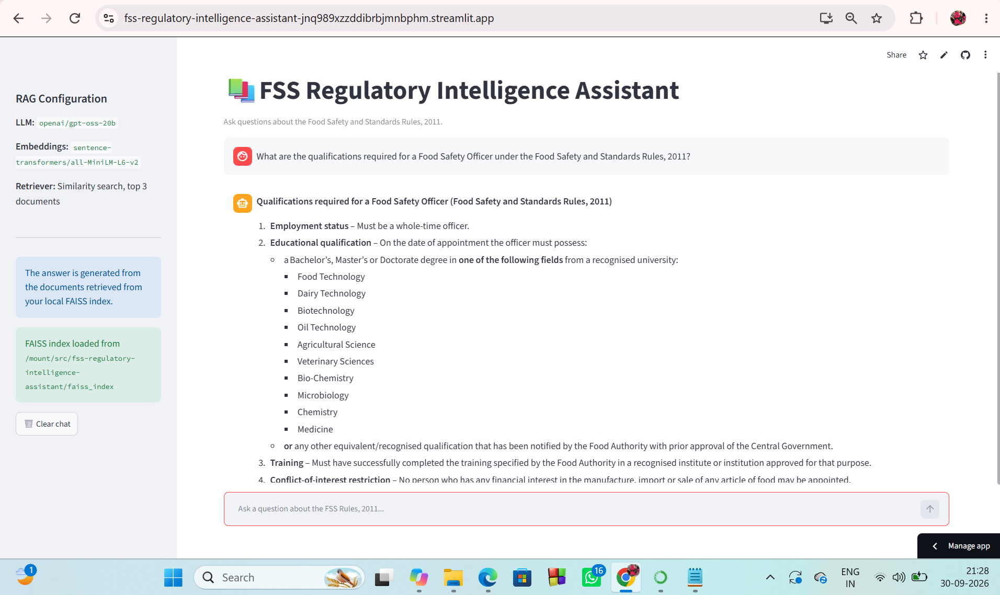
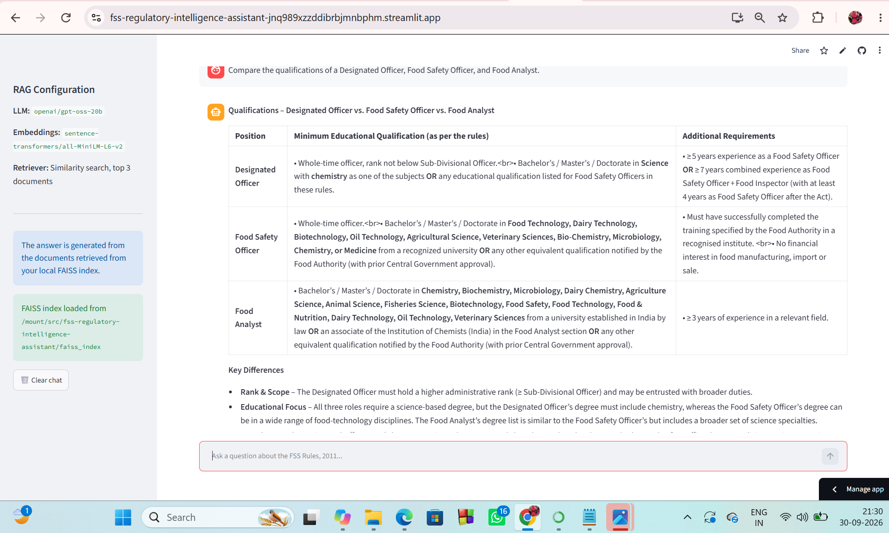

# FSS Regulatory Intelligence Assistant

An LLM-powered Retrieval-Augmented Generation (RAG) application that allows users to ask natural-language questions about the Food Safety and Standards Rules, 2011.

The application retrieves relevant information from the regulatory document using semantic vector search and generates a context-aware answer using a Large Language Model (LLM).

## 🚀 Features

- Natural-language question answering
- Retrieval-Augmented Generation (RAG)
- PDF-based knowledge retrieval
- Semantic similarity search
- FAISS vector database
- Hugging Face sentence-transformer embeddings
- LangChain-based RAG pipeline
- Groq LLM inference
- Streamlit web interface
- Retrieved source/page information
- Chat-based question answering

## 🖥️ Application Screenshots

### 1. Streamlit Application

The Streamlit interface allows users to ask natural-language questions about the Food Safety and Standards Rules, 2011.



### 2. Advanced Question Answering

Example of the application retrieving relevant regulatory information and generating a context-aware response.



## 🏗️ Architecture

```text
                 FSS Rules PDF
                       │
                       ▼
              Document Processing
                       │
                       ▼
                  Text Chunks
                       │
                       ▼
             Hugging Face Embeddings
                       │
                       ▼
                    FAISS
                Vector Database
                       │
                       │
User Question ─────────┘
       │
       ▼
 Semantic Retrieval
       │
       ▼
 Relevant Document Chunks
       │
       ▼
     LangChain
       │
       ▼
     Groq LLM
       │
       ▼
 Generated Answer
       │
       ▼
    Streamlit UI

## 🚀 Live Demo

Try the deployed application here:

👉 **[FSS Regulatory Intelligence Assistant](https://fss-regulatory-intelligence-assistant-jnq989xzzddibrbjmnbphm.streamlit.app/)**

The application is deployed using Streamlit Community Cloud.
